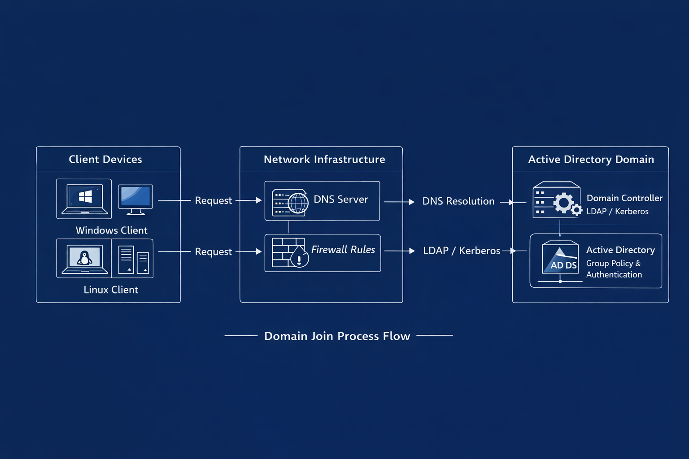
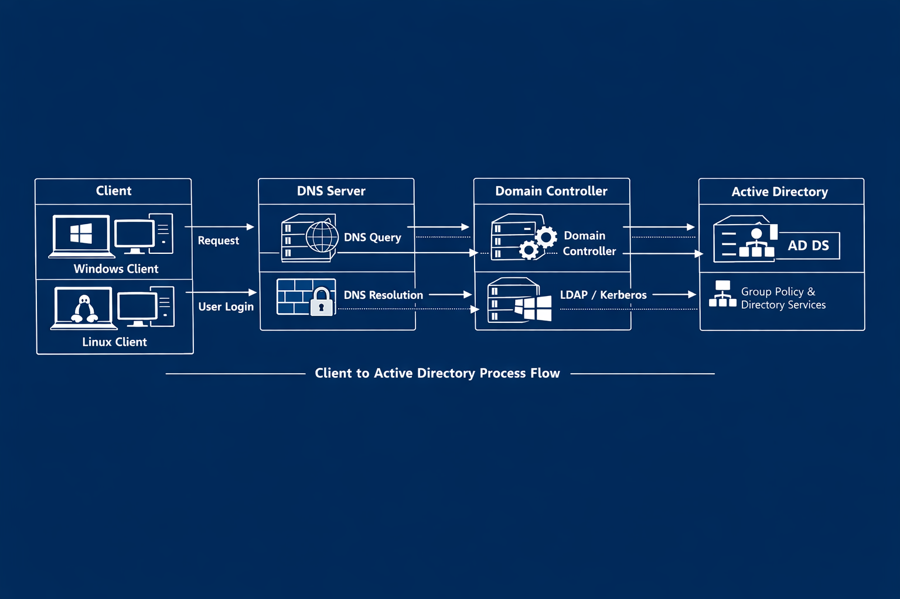
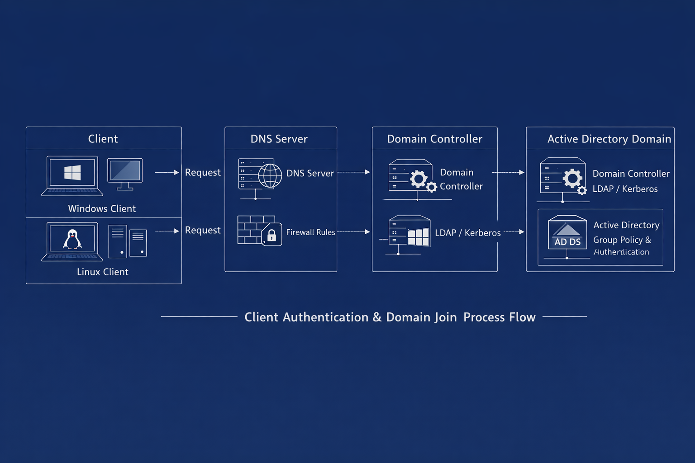

# 🧪 Testing & Validation Guide
### Unified Post‑Join Verification for Windows 10, Windows 11, and Linux Clients

---

## 🏷️ Status Badges

| Validation Area | Status |
|-----------------|--------|
| 🟦 Network Connectivity | ✔ Required |
| 🟩 DNS Resolution | ✔ Required |
| 🟧 Authentication & Kerberos | ✔ Required |
| 🟪 Group Policy / SSSD | ✔ Required |
| 🟥 Troubleshooting Required if Any Fail | ⚠ Action Needed |

---

## 📘 Overview
This guide provides a **structured, OS‑agnostic validation workflow** to confirm that clients have successfully joined the Active Directory domain in the Hyper‑V homelab.

It covers:

- Network validation  
- DNS verification  
- Domain controller reachability  
- Authentication testing  
- Kerberos & time sync checks  
- Group Policy / SSSD validation  
- Troubleshooting  
- Diagram references  

OS‑specific guides:

- **Windows 10** → `windows10.md`  
- **Windows 11** → `windows11.md`  
- **Linux (Ubuntu)** → `linux.md`  

---

## 1️⃣ Pre‑Validation Requirements
> 🟦 **INFO**  
> These checks ensure the environment is healthy before testing.

### **Domain Services**
- AD DS healthy  
- DNS zones functioning  
- DCs respond to ping + DNS queries  
- DHCP issuing correct IP configuration  

### **Client Requirements**
- Client is domain‑joined  
- Client has rebooted  
- Domain credentials available  
- Local admin access available  

---

## 2️⃣ Network & Connectivity Validation
> 🟧 **WARNING**  
> Most domain join failures are caused by **DNS misconfiguration** or **incorrect network settings**.

### **Step 1 — Confirm IP Configuration**

**Windows**
```powershell
ipconfig /all
```

**Linux**
```bash
ip a
```

**Expected:**
- Correct IP range  
- DNS = Domain Controller  
- Default gateway reachable  

---

### **Step 2 — Test Connectivity to Domain Controller**

```bash
ping dc01.lab.local
```

**Expected:**
- Replies within 1–5ms (Hyper‑V)  
- No packet loss  

---

### **Step 3 — Validate DNS Resolution**

**Windows**
```powershell
nslookup lab.local
nslookup dc01.lab.local
```

**Linux**
```bash
dig lab.local
```

**Expected:**
- DNS server = DC  
- Correct A records returned  

---

## 3️⃣ Time Synchronisation Validation
> 🟥 **CRITICAL**  
> Kerberos fails if time differs from the DC by **more than 5 minutes**.

**Windows**
```powershell
w32tm /query /status
```

**Linux**
```bash
timedatectl
```

If out of sync:

**Windows**
```powershell
w32tm /resync
```

**Linux**
```bash
timedatectl set-ntp true
```

---

## 4️⃣ Authentication & Login Validation

### **Step 1 — Test Domain Login**
- Windows: `LAB\username`  
- Linux: `lab\\username`  

**Expected:**  
Login successful, no Kerberos or credential errors.

---

### **Step 2 — Validate Kerberos Tickets**

```bash
klist
```

**Expected:**  
- Ticket cache present  
- `krbtgt` ticket issued  
- No clock skew errors  

---

## 5️⃣ Group Policy / SSSD Validation
> 🟦 **INFO**  
> Confirms the client is fully integrated with AD.

### **Windows Validation**

Force policy update:
```powershell
gpupdate /force
```

Check applied policies:
```powershell
gpresult /r
```

**Expected:**  
- Computer + user settings applied  
- No GPO errors  

---

### **Linux Validation**

Check domain identity resolution:
```bash
id lab\\username
```

Check NSS integration:
```bash
getent passwd lab\\username
```

**Expected:**  
- UID/GID returned  
- SSSD resolving domain users  

---

## 6️⃣ Service‑Level Validation

### **LDAP Connectivity**
```powershell
nltest /dsgetdc:lab.local
```

**Expected:**  
- DC name returned  
- LDAP/Kerberos available  

---

### **SMB Share Access**

**Windows**
```powershell
\\dc01\sysvol
```

**Linux**
```bash
smbclient -L //dc01.lab.local -U lab\\username
```

**Expected:**  
- SYSVOL accessible  
- No permission errors  

---

## 7️⃣ Troubleshooting (All Operating Systems)

### 🟥 DNS Issues (Most Common)
**Symptoms:**  
- “Domain not found”  
- Join succeeds but login fails  

**Fix:**
```powershell
ipconfig /flushdns
systemd-resolve --flush-caches
nslookup lab.local
```

---

### 🟧 Time Skew
**Symptoms:**  
- Kerberos errors  
- Login failures  

**Fix:**
```powershell
w32tm /resync
timedatectl set-ntp true
```

---

### 🟦 Firewall / Connectivity
**Symptoms:**  
- Join fails instantly  
- Authentication errors  

**Fix:**  
Ensure ports **53, 88, 389, 445** are open  
Confirm DC reachable via ping  

---

### 🟪 SSSD / Linux Authentication
**Symptoms:**  
- Login fails  
- `id` returns “no such user”  

**Fix:**
```bash
systemctl restart sssd
realm list
```

---

## 8️⃣ Diagrams

- **Client → Network Infrastructure → Active Directory Domain**  
  


- **Client → DNS → Domain Controller → AD DS**  
  


- **Windows + Linux Authentication Flow**  
  


---

## 9️⃣ Version History

| Version | Date | Changes |
|---------|------|---------|
| 1.1 | Updated | Added badges + visual callouts |
| 1.0 | Initial | Created unified testing & validation guide |
